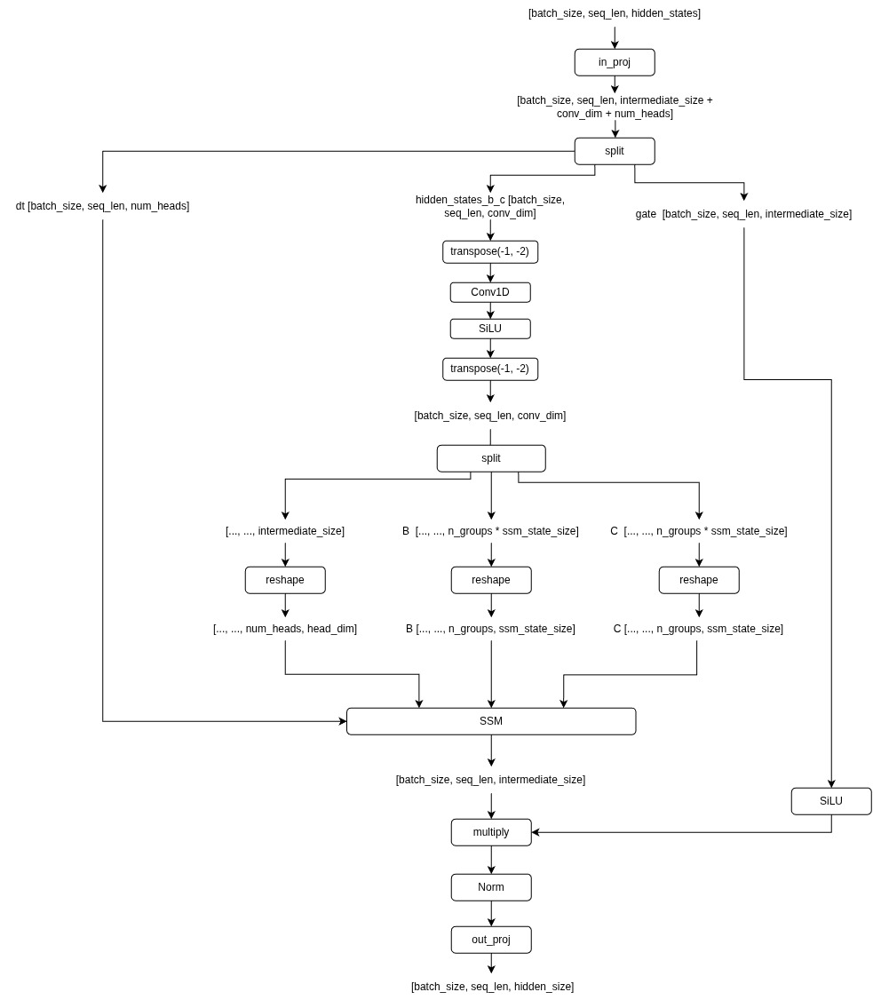
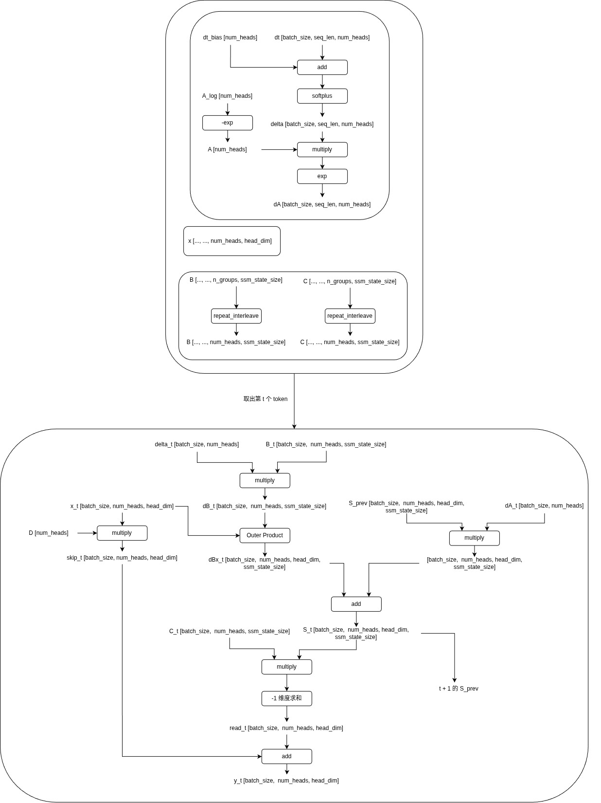

# Mamba2
## Mamba2 Block

### Mamba2 Block Forward

### Mamba2 Block SSM 
intermediate_size = hidden_size * mamba_expand 
intermediate_size = mamba_n_heads * mamba_d_head
bc_dim = mamba_n_groups * mamba_d_state
conv_dim = intermediate_size + 2 * bc_dim

